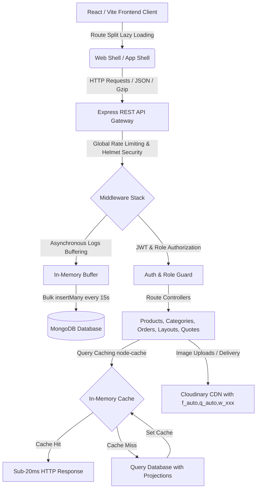

# TezTech - Enterprise-Grade MERN Stack E-Commerce Platform

TezTech is a full-featured, secure, and highly-optimized e-commerce platform built for high-performance electronic retail. The platform provides a seamless B2C buyer experience alongside a powerful Administrative Dashboard for bulk inventory management, dynamic order logs, multi-tier user role delegation, custom quotation generators, and detailed analytics.

---

## 🏗️ System Architecture & Workflow

---

## 🛠️ Complete Feature Modules (From Zero to Now)

### 1. 🔑 Security, Authentication & Role Management
- **Verification Flow**: Custom OTP (One-Time Password) registration flow. Generates temporary validation tokens and sends OTPs via NodeMailer SMTP, with active cooldown resend timers.
- **Session Security**: Stateless session management using HTTP-only cookies and Authorization headers carrying JSON Web Tokens (JWT). Passwords are cryptographically hashed using `bcryptjs`.
- **Role-Based Access Control (RBAC)**: Fine-grained gateway middleware (`protect`, `authorize`) that segregates routes between public Buyers, Sub-Admins, and Super-Admins.
- **Account Recovery**: Forgot Password handler generating secure reset tokens and emailing dynamic verification links.

### 2. 🛍️ Dynamic Buyer Interface (Frontend)
- **Interactive Home Banner**: Swiper.js-based slider accommodating high-resolution banners, promotional videos, and embedded silent looping YouTube clips.
- **Nesting Category Taxonomy**: Drill-down categories listing page enabling users to browse root categories, drill into sub-folders, and view matching catalogs without full page reloads.
- **Intuitive Products Catalog**: Debounced keyword searches, live filters (grouped by categories, price sliders), pagination controls, and skeletal layout loaders.
- **Product Details & Configurator**: 
  - Dynamic aspect-ratio preserving image viewer with gallery zoom.
  - Variant Configuration: Supports price adjustment offsets, custom stock validation, and SKU tracking for dynamic product combinations (e.g. specifications, colors).
  - Web Share API: Instantly triggers native OS sharing on mobile devices, or falls back to clipboard copies on desktop browsers.
- **Local Shopping Cart**: Handles items addition, quantity adjustment constraints, custom fields serialization, and dynamic shipping calculations.
- **Checkout Pipeline**: Multipage checkout forms (address inputs, shipping providers options, payment selectors, order summary cards) leading to order success templates.

### 3. 📄 Custom B2B Quotation System
- **Buyers Quote Requests**: Allows users to add multi-variant products to a custom quote request queue and submit it to the administrative desk.
- **Unique Share Tokens**: Generates secure access tokens for custom quotations, allowing buyers to view finalized quotes, check itemized tax tables, and download invoices as PDFs.
- **Client PDF Invoice Generator**: Integrated `jsPDF` and `html2canvas` on the frontend, allowing buyers to download official branded PDF quotations for offline processing.

### 4. 👑 Administrative Dashboard (`/admin`)
- **Interactive Analytics**: Graphical reports displaying active sales metrics, order timelines, product distributions, and database volumes.
- **Product Editor**: Manual product creator supporting custom specifications tables, tags parsing, image uploads, and instant listing visibility toggles.
- **Nested Categories Manager**: Complete CRUD for categories with drag-and-drop hierarchy configurations. Includes an automated database clean-up helper that sweeps and purges unused orphan categories.
- **Dynamic Order Workflow**: Full order tracking queues. Admins can update order statuses (Processing, Shipped, Delivered) and view interactive shipment timelines.
- **Bulk CSV Upload Engine**:
  - Robust CSV parser that strips Excel BOM characters.
  - Automatically parses dynamic headers to construct nested category structures.
  - Supports `bulkWrite` operations with rollback histories, allowing admins to view import job logs and permanently delete failed imports by rolling them back.
- **Shipping Provider Configurator**: Dashboard to manage active logistics and shipping charges rules.
- **Sub-Admin Delegation**: Super-admin panel to create and restrict sub-admin credentials.

---

## ⚡ Core Optimizations & Architecture (Interview Highlights)

To ensure this platform behaves like a high-scale production application, we implemented the following performance and security patterns:

### 1. Database Indexing & Search Speedups
- **MongoDB Text Indexes**: Replaced table-scanning `$regex` logic in products search with native MongoDB `$text` indexes.
- **Sub-string Sorting Fix**: Configured a conditional `$cond` operator in the aggregation pipeline. If a keyword index matches via word-stemming but returns `-1` on literal prefix check, it is assigned a sort weight of `9999` (sending it to the bottom), ensuring exact matches bubble to the top.
- **Optimized Field Indexes**: Activated indexes on `slug`, `category`, `status`, and `price` to resolve query filter groups without collection scans.

### 2. High-Performance Caching & Write Decoupling
- **In-Memory Cache**: Integrated a `node-cache` layer caching home page layouts, categories lists, and products listings, dropping query times from **~500ms to sub-20ms**.
- **State Invalidation**: Connected cache invalidation triggers to all database mutation endpoints (update, create, delete, CSV import, rollback).
- **Traffic Log Buffering**: Decoupled database write logging from HTTP requests by buffering logs in RAM. Entries are batch-inserted asynchronously using Mongoose `insertMany` every 15 seconds (or when the queue hits 50 entries), avoiding disk I/O bottlenecks.

### 3. Payload Reduction & Browser Optimization
- **Query Projections**: Added `$project` pipeline stages and `.select(...)` statements to listing APIs, fetching only card details (omitting details/specs) to save server memory and network bandwidth.
- **Gzip Compression**: Integrated `compression` middleware to automatically zip API response sizes by up to 90%.
- **Uploads Cache Controls**: Configured static files middleware with `maxAge: '30d'` and `immutable: true` settings, enabling browsers to load product images locally.
- **Cloudinary Responsive Resizing**: Modified the image utility to append context-aware dynamic widths (`w_150`, `w_400`, `w_800`, `w_1200`) to Cloudinary URLs, preventing high-resolution image over-fetching.

### 4. Code Splitting & Route Guards
- **React Lazy Loading**: Configured dynamic imports (`React.lazy`) for all major route pages inside `App.jsx`, wrapped in a `<Suspense>` wrapper with a custom glassmorphic spinner.
- **Router Input Validators**: Mounted `express-validator` middleware on registration and login endpoints to reject malformed inputs early at the router level.
